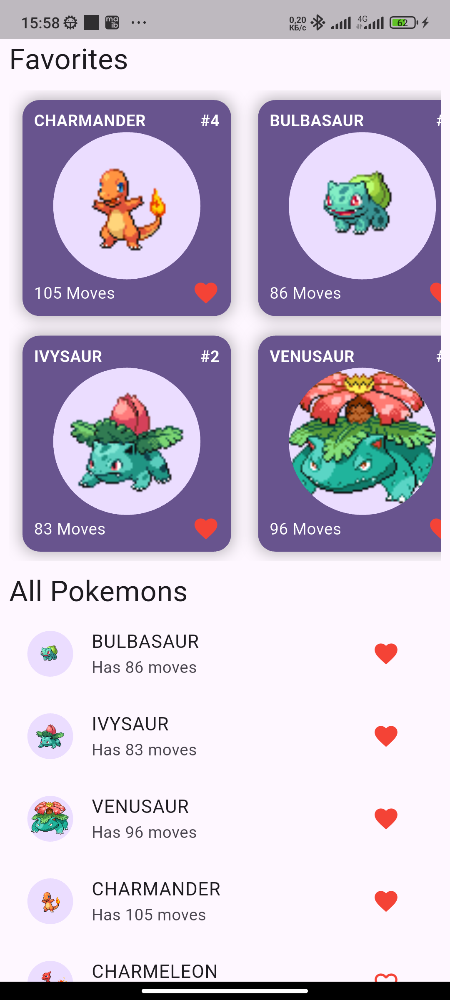
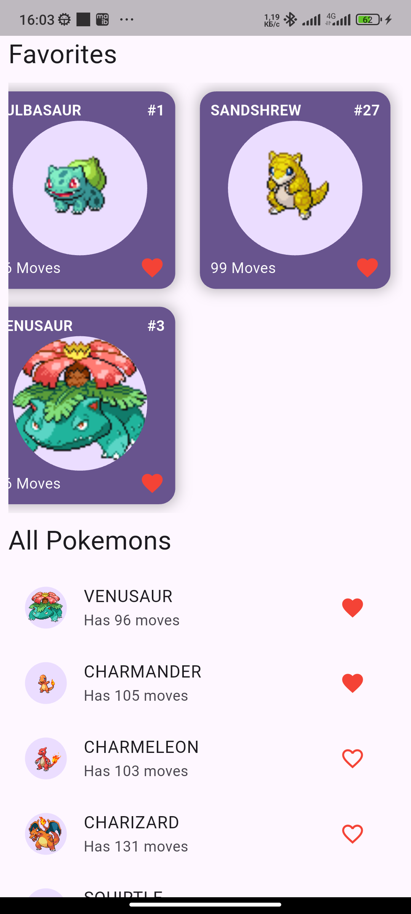
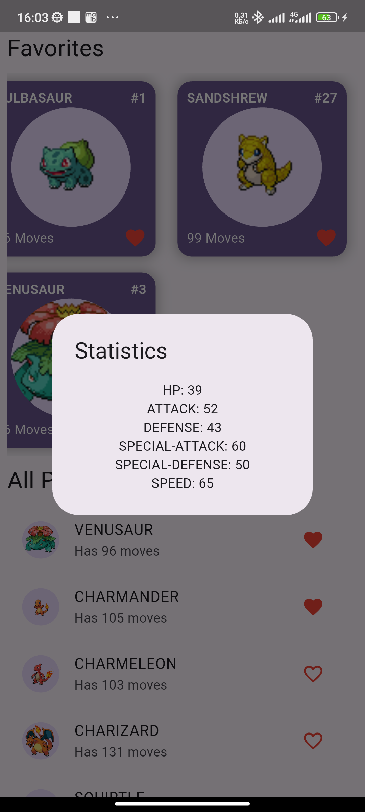

<div align="center">

# ⚡ PokéDex Flutter

**A sleek Pokédex mobile app built with Flutter & Riverpod**


</div>

---

## About

**PokéDex Flutter** is a mobile application that lets you explore the full Pokémon universe right from your phone. Browse over 1000 Pokémon, inspect their stats and moves, and build your personal collection of favorites — all powered by the free [PokéAPI](https://pokeapi.co).

The project showcases a clean, production-ready Flutter architecture using **Riverpod** for reactive state management and **GetIt** for dependency injection.

---

## Features

| Feature | Description |
|---|---|
| **Browse All Pokémon** | Infinite-scroll list that loads more Pokémon as you reach the bottom |
| **Pokémon Details** | Tap any Pokémon to see its base stats (HP, Attack, Defense, Speed, and more) |
| **Favorites** | Heart any Pokémon to save it to your personal favorites grid |
| **Persistent Storage** | Favorites survive app restarts — saved locally with SharedPreferences |
| **Skeleton Loading** | Smooth skeleton animations while data is being fetched |
| **Material 3 UI** | Modern Deep Purple theme following Material You guidelines |

---

## Screenshots

| Home — Favorites | Home — All Pokémon | Stats Dialog |
|:---:|:---:|:---:|
|  |  |  |

---

## Tech Stack

```
Flutter (Dart)
├── State Management  →  flutter_riverpod ^3.3.2
├── HTTP Client       →  dio ^5.9.2
├── DI Container      →  get_it ^9.2.1
├── Local Storage     →  shared_preferences ^2.5.5
├── Loading Skeletons →  skeletonizer ^2.1.3
├── Fonts             →  google_fonts ^8.1.0
└── API               →  PokéAPI v2 (https://pokeapi.co)
```

---

## Project Structure

```
lib/
├── main.dart                        # App entry point & service registration
├── models/
│   ├── pokemon.dart                 # Pokemon, Sprites, Stats, Abilities, Moves
│   └── page_data.dart               # Pagination state model
├── services/
│   ├── http_service.dart            # Dio HTTP wrapper
│   └── database_service.dart        # SharedPreferences wrapper
├── providers/
│   └── pokemon_data_providers.dart  # pokemonDataProvider + favoritePokemonsProvider
├── controllers/
│   └── home_page_controller.dart    # Pagination logic (infinite scroll)
├── pages/
│   └── home_page.dart               # Main screen
└── widgets/
    ├── pokemon_card.dart            # Favorite card (grid item)
    ├── pokemon_list_tile.dart       # List row with favorite toggle
    └── pokemon_stats_cart.dart      # Stats dialog
```

---

## Architecture

The app follows a clean layered architecture:

```
UI (pages / widgets)
      │
      ▼
Providers / Controllers  (Riverpod NotifierProvider & FutureProvider.family)
      │
      ▼
Services  (HttpService via Dio · DatabaseService via SharedPreferences)
      │
      ▼
PokéAPI v2  /  Local Storage
```

- **`pokemonDataProvider`** — `FutureProvider.family` that fetches and caches individual Pokémon data by URL.
- **`favoritePokemonsProvider`** — `NotifierProvider` that holds the list of favorited URLs and syncs them to SharedPreferences.
- **`homePageControllerProvider`** — `NotifierProvider` that drives infinite-scroll pagination against the PokeAPI list endpoint.

---

## Getting Started

### Prerequisites

- [Flutter SDK](https://docs.flutter.dev/get-started/install) `>=3.0.0`
- Dart `>=3.0.0`
- Android Studio / VS Code with Flutter plugin
- A connected device or emulator

### Run Locally

```bash
# 1. Clone the repository
git clone https://github.com/Tasha290929/riverpod_pokedex_app.git
cd riverpod_pokedex_app

# 2. Install dependencies
flutter pub get

# 3. Run the app
flutter run
```

### Build Release APK

```bash
flutter build apk --release
```

---

## How It Works

1. On launch, `HomePageController` calls PokéAPI to fetch the first 20 Pokémon.
2. As the user scrolls to the bottom of the list, the next page is automatically loaded.
3. Each row/card uses `pokemonDataProvider(url)` — a cached `FutureProvider` — so data is never re-fetched unnecessarily.
4. Tapping a Pokémon opens a stats dialog powered by the same cached provider (zero extra network call).
5. Tapping the heart icon adds/removes the Pokémon URL in `favoritePokemonsProvider`, which persists the updated list to SharedPreferences immediately.
6. The favorites grid at the top of the home page reacts to state changes in real time.

---

## API Reference

This app consumes the free **PokéAPI v2**:

| Endpoint | Usage |
|---|---|
| `GET /api/v2/pokemon?limit=20&offset=N` | Paginated list of all Pokémon |
| `GET /api/v2/pokemon/{id or name}/` | Full details for a single Pokémon |

No API key required. Docs: [pokeapi.co/docs/v2](https://pokeapi.co/docs/v2)

---

## Contributing

Pull requests are welcome! For major changes, please open an issue first to discuss what you'd like to change.

1. Fork the repository
2. Create your feature branch (`git checkout -b feature/my-feature`)
3. Commit your changes (`git commit -m 'Add my feature'`)
4. Push to the branch (`git push origin feature/my-feature`)
5. Open a Pull Request

---

## License

This project is licensed under the MIT License. See [LICENSE](LICENSE) for details.

---

<div align="center">

Made with ❤️ and Flutter · Powered by [PokéAPI](https://pokeapi.co) · [YouTube](https://pokeapi.co](https://www.youtube.com/watch?v=vBhQx2qDtGQ)

</div>
